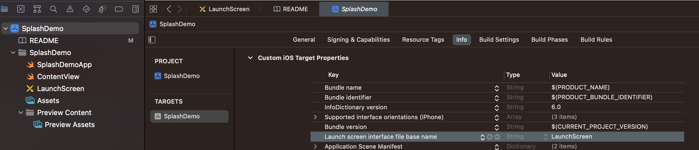

# SplashDemoSwiftUI
How to Add splash screen in SwiftUI?
-> Just add #LaunchScreen.storyboard# file in your target
-> Change UI as per your need

What setting need to change in plist?
-> go to Project -> Target -> Info
add below key "Launch screen interface file base name" & file name "LaunchScreen"

# Setting
|  
